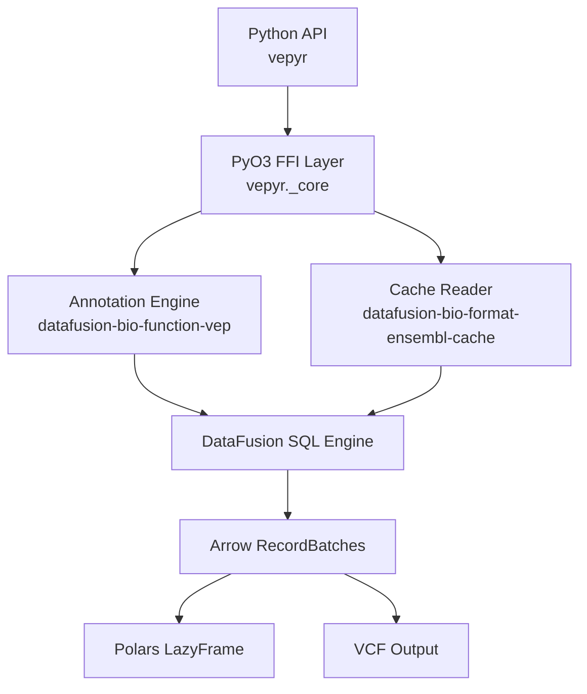
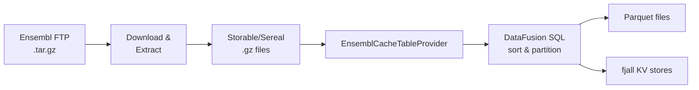
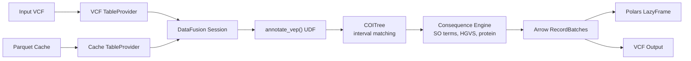

# Architecture

## Overview

vepyr is a Python library with a native Rust core, built on top of [Apache DataFusion](https://datafusion.apache.org/) and [Apache Arrow](https://arrow.apache.org/). It wraps two Rust crates from the [biodatageeks](https://github.com/biodatageeks) ecosystem.

## Layers

### Python API layer

**Location:** `src/vepyr/__init__.py`

The public surface is intentionally minimal — two functions:

- `build_cache()` — download, extract, and convert Ensembl VEP offline caches
- `annotate()` — annotate VCF files against converted caches

This layer handles validation, download orchestration, progress reporting, and conversion of Arrow batches to Polars LazyFrames.

### PyO3 FFI layer

**Location:** `src/lib.rs`, `src/annotate.rs`

Bridges Python and Rust via [PyO3](https://pyo3.rs/). Key exports:

- `convert_entity()` — convert a single cache entity to Parquet
- `create_annotator()` — create a `StreamingAnnotator` that yields PyArrow `RecordBatch`es
- `annotate_vcf()` — annotate and write directly to VCF

Errors are normalized to `PyRuntimeError` at this boundary.

### Rust engine

**Location:** `src/convert.rs`, `src/annotate.rs`

The heavy lifting happens here:

- **Cache conversion** (`convert.rs`): reads Ensembl's Storable/Sereal `.gz` files via `EnsemblCacheTableProvider`, runs DataFusion SQL queries, and writes sorted Parquet files with tuned row groups.
- **Annotation** (`annotate.rs`): registers VCF and cache table providers with DataFusion, builds SQL queries with `annotate_vep()` / `lookup_variants()` UDFs, and streams results as Arrow `RecordBatch`es.

### Upstream crates

| Crate | Purpose |
|---|---|
| `datafusion-bio-function-vep` | Annotation UDFs: allele matching, transcript consequence prediction (SO terms, HGVS, protein impact), exposed as DataFusion functions |
| `datafusion-bio-format-ensembl-cache` | Reads Ensembl VEP offline cache directories into DataFusion `TableProvider`s with Arrow schemas |
| `datafusion-bio-format-vcf` | VCF file reader as DataFusion `TableProvider` |

## Data flow

### Cache building

Entity types processed: `Variation`, `Transcript`, `Exon`, `Translation`, `RegulatoryFeature`, `MotifFeature`.

### Variant annotation

### Memory model

- **Streaming**: annotation results are streamed as Arrow `RecordBatch`es — full datasets are never materialized in memory
- **Cache**: the annotation engine maintains an LRU cache (`cache_size_mb`, default 1 GB) for transcript/variation data
- **Zero-copy**: Python receives PyArrow batches via zero-copy transfer from Rust

## Technology stack

| Component | Technology |
|---|---|
| Language (engine) | Rust 2021 edition |
| Language (API) | Python 3.10+ |
| Python bindings | PyO3 0.25, abi3 stable ABI |
| Query engine | Apache DataFusion 50.3 |
| Data format | Apache Arrow 56 |
| Async runtime | Tokio |
| Interval trees | COITree |
| KV store | fjall (embedded, LSM-based) |
| DataFrame | Polars |
| Build system | maturin + uv |
