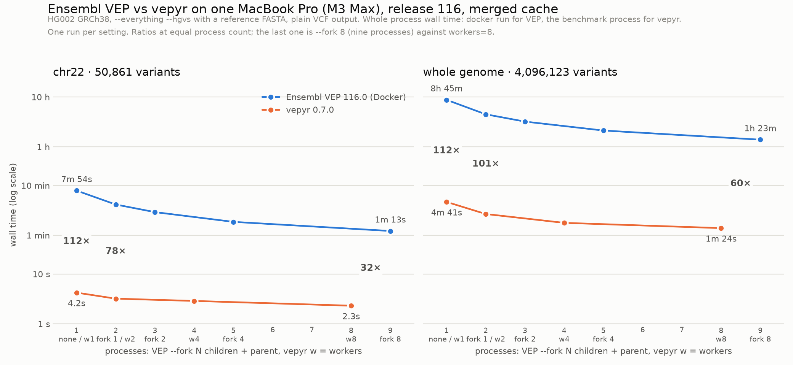

# Performance

## Design goals

vepyr targets a **30x+ speedup** over the reference Ensembl VEP Perl implementation while maintaining **zero mismatches** for the supported annotation scope.

## Why it's fast

### Native Rust engine

The entire annotation pipeline — allele matching, interval tree lookups, consequence prediction, HGVS computation — runs in compiled Rust code. No interpreter overhead touches the hot path.

### Apache DataFusion

vepyr uses [DataFusion](https://datafusion.apache.org/) as its query execution substrate. This provides:

- Vectorized execution over Arrow columnar batches
- Predicate pushdown to minimize data scanned
- Parallel partition processing

### Streaming architecture

Results are streamed as Arrow `RecordBatch`es rather than materializing full datasets in memory. This keeps memory usage bounded regardless of input VCF size.

### Optimized cache format

The Ensembl VEP offline cache ships as Perl `Storable` / `Sereal` serialized files. vepyr converts these to a partitioned **Parquet** cache — columnar, compressed, with sorted row groups, per-chromosome shards, and a page/column index that powers fast point lookups for co-located variants.

### COITree interval matching

Transcript overlap queries use [COITree](https://github.com/dcjones/coitree) (cache-oblivious interval trees), which provide O(n + log(n)) query performance.

## Benchmarking

### Running a comparison

To benchmark vepyr against Ensembl VEP on the same input. For the full parity setup —
downloading the HG002 benchmark VCF, normalizing it, and running the comparison harness —
see [Testing against Ensembl VEP](testing-vep.md).

**Ensembl VEP (Docker):**

```bash
time docker run --rm \
  -v /data/vep/homo_sapiens/115_GRCh38:/opt/vep/.vep/homo_sapiens/115_GRCh38:ro \
  -v /work:/work \
  ensemblorg/ensembl-vep:release_115.2 \
  vep \
  --dir /opt/vep/.vep \
  --cache --offline --assembly GRCh38 \
  --input_file /work/input.vcf \
  --output_file /work/output.vcf \
  --vcf --force_overwrite --no_stats \
  --everything
```

**vepyr:**

```python
import vepyr
import time

start = time.time()
lf = vepyr.annotate(
    vcf="input.vcf",
    cache_dir="/data/vepyr_cache/parquet/115_GRCh38_ensembl",
    everything=True,
    reference_fasta="GRCh38.fa",
)
df = lf.collect()
elapsed = time.time() - start
print(f"{df.height} variants in {elapsed:.1f}s")
```

### Ensembl VEP vs vepyr on one machine

Both tools annotated the same normalized HG002 GRCh38 input with the same
release-116 merged cache, `--everything --hgvs` and a reference FASTA, writing
plain VCF, on one MacBook Pro (Apple M3 Max, 16 cores, 64 GiB). VEP ran in
its native arm64 Docker image (16 vCPU, 16.5 GiB VM); vepyr 0.7.0 ran on the
host. Whole-process wall time, one run per setting. VEP `--fork N` runs N
annotation children plus the parent, so the runs are paired by process count:
VEP without `--fork` against vepyr's default `workers=1`, `--fork 1` against
`workers=2`, and `--fork 8` (nine processes) against `workers=8`.



| Input | Ensembl VEP 116.0 | vepyr 0.7.0 | Ratio |
|---|---|---|---|
| chr22, 50,861 variants | no fork, 7:54 | `workers=1`, 4.2 s | 112× |
| | `--fork 1`, 4:09 | `workers=2`, 3.2 s | 78× |
| | `--fork 8`, 1:13 | `workers=8`, 2.3 s | 32× |
| whole genome, 4,096,123 variants | no fork, 8:45:41 | `workers=1`, 4:41 | 112× |
| | `--fork 1`, 4:29:09 | `workers=2`, 2:40 | 101× |
| | `--fork 8`, 1:23:15 | `workers=8`, 1:24 | 60× |

On chr22 the vepyr `workers=8` output is CSQ-identical to VEP's serial run on
all 50,861 records; against VEP `--fork 8` the only differences are 115
records where VEP's forked run leaves `HGNC_ID` empty. The full sweeps
(`--fork` / `workers` 1, 2, 4, 8), the logs, checksums and the exact commands
are in
[`performance-tests/README.md`](https://github.com/biodatageeks/vepyr/blob/master/performance-tests/README.md).

### Region filters

A LazyFrame `filter()` on `chrom`, `start` or `end` is pushed into the engine
before annotation (see [Polars DataFrames](dataframes.md#region-filters)).
Measured with `e2e-testing/scripts/region_pushdown_parity.py --release 116` on
HG002 contig slices, `everything=True`, a FASTA, `workers=1`, on an Apple Silicon M3 Max (16 cores, 64 GiB). Every
pushed-down frame was identical to the whole-slice frame filtered in Polars.

| Input | Query | Rows | Ensembl | Merged | RefSeq |
|---|---|---|---|---|---|
| chr22, 50,861 variants, indexed | `collect()` | 50,861 | 2.6 s | 3.2 s | 2.0 s |
| | `chr22:20,000,000-25,000,000` | 5,406 | 0.6 s | 1.3 s | 0.8 s |
| | `chr22:30,000,000-30,100,000` | 59 | 0.1 s | 0.7 s | 0.5 s |
| | `chr22:17,000,000-17,500,000` or `chr22:40,000,000-40,200,000` | 1,262 | 0.2 s | 1.2 s | 0.8 s |
| | `chr22:45,000,000-` | 10,650 | 0.6 s | 1.1 s | 0.7 s |
| chr22, unindexed copy | `chr22:20,000,000-25,000,000` | 5,406 | 0.6 s | 1.2 s | 0.8 s |
| chr1, 323,430 variants, indexed | `collect()` | 323,430 | 17.0 s | 22.5 s | 14.9 s |
| | `chr1:20,000,000-25,000,000` | 7,871 | 1.2 s | 2.9 s | 1.7 s |
| | `chr1:30,000,000-30,100,000` | 275 | 0.6 s | 1.8 s | 1.1 s |
| | `chr1:17,000,000-17,500,000` or `chr1:40,000,000-40,200,000` | 1,718 | 1.0 s | 2.9 s | 1.9 s |
| | `chr1:200,000,000-` | 73,839 | 3.8 s | 6.1 s | 3.4 s |
| chr1, unindexed copy | `chr1:20,000,000-25,000,000` | 7,871 | 1.6 s | 2.4 s | 1.4 s |

Merged and RefSeq ranges pay for one positional count pass over the contig
plus a warm-up of the input buffers before the range, which keeps their output
byte-identical to a whole-file run. Without an index the whole slice is parsed
and filtered before annotation, so small ranges gain less.

### Workers on the LazyFrame path

Measured with `e2e-testing/scripts/lazyframe_workers_parity.py --release 116 --sweep 1 2 4 8`
on HG002 contig slices, `everything=True`, a FASTA, on an Apple Silicon M3 Max
(16 cores, 64 GiB) while other work ran on the host. Every frame equalled the
`workers=1` frame row for row, and the LazyFrame CSQ column equalled the
`output_vcf` INFO/CSQ at `workers=8`.

| Input | workers | Ensembl | Merged | RefSeq |
|---|---|---|---|---|
| chr22, 50,284 variants | 1 | 2.5 s | 3.5 s | 2.2 s |
| | 2 | 2.0 s | 2.5 s | 1.6 s |
| | 4 | 1.2 s | 1.8 s | 1.2 s |
| | 8 | 0.9 s | 1.7 s | 1.0 s |
| chr1, 319,349 variants | 1 | 16.7 s | 21.4 s | 15.0 s |
| | 2 | 10.1 s | 13.8 s | 9.8 s |
| | 4 | 6.4 s | 9.0 s | 6.5 s |
| | 8 | 3.9 s | 5.7 s | 3.5 s |

Each contig is cut into grid-aligned runs that a pool of `workers` tasks
annotates concurrently and releases in order.

### Tuning

| Parameter | Default | Effect |
|---|---|---|
| `cache_size_mb` | `1024` | LRU cache for annotation data — increase for large inputs |
| `workers` | `1` | Within-contig annotation pipelines on both output paths; values greater than 1 require a tabix-indexed (bgzip + `.tbi`/`.csi`) input VCF. Output is identical to `workers=1`, row order included. On the [command line](cli.md) this is `--fork`. |
| region filters | – | A LazyFrame `filter()` on `chrom`/`start`/`end` is pushed into the engine: unselected contigs are skipped and indexed inputs are read by seek (see [Polars DataFrames](dataframes.md#region-filters)). |
| `partitions` | `1` | DataFusion partitions during cache build — increase for parallel conversion |

!!! tip "Compile-time optimization"
    For maximum throughput, build with native CPU instructions:

    ```bash
    RUSTFLAGS="-C target-cpu=native" uv sync --reinstall-package vepyr
    ```
