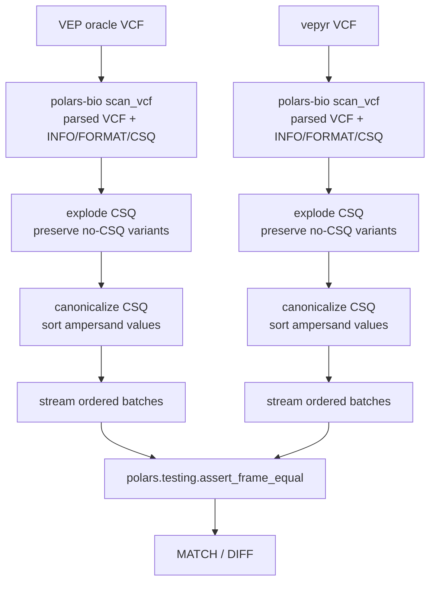

# VEP-vs-vepyr DataFrame Concordance

This directory contains a small reviewer-facing comparator for semantic
annotation concordance. It compares VEP and vepyr annotation rows as ordered
Polars DataFrame batches.

The comparator reads the parsed VCF representation produced by `polars-bio`,
including variant columns, non-CSQ `INFO` fields, `FORMAT` fields, and sample
columns. It explodes `INFO/CSQ` into one annotation row per consequence,
keeps variants without CSQ as one row with an empty `canonical_csq_entry`,
canonicalizes ampersand-delimited values inside each CSQ field, and compares
successive batches with `polars.testing.assert_frame_equal`.

This is intentionally order-sensitive. It is appropriate for profiles where
VEP and vepyr are expected to emit the same variant and CSQ order. It is not the
right comparator for known order-unstable VEP modes such as `--per_gene`.

The asserted columns are the shared parsed VCF columns, with `start` renamed to
`pos`, plus:

```text
canonical_csq_entry
```

Row multiplicity is preserved as repeated rows. Variants without CSQ are still
compared once, so their parsed non-CSQ VCF fields remain covered.

## Usage

Run through the parent harness:

```bash
../run_concordance.sh dataframe
```

Or run this comparator directly:

```bash
python compare_annotation_frames.py vep.vcf vepyr.vcf
```

Adjust streaming batch size:

```bash
python compare_annotation_frames.py vep.vcf vepyr.vcf --chunk-size 500000
```

Print progress every N compared annotation rows:

```bash
python compare_annotation_frames.py vep.vcf vepyr.vcf --progress-every 1000000
```

## Output

The script prints:

- number of shared CSQ fields,
- CSQ fields present only on one side, if any,
- parsed input columns,
- CSQ canonicalization rule,
- asserted DataFrame columns,
- progress interval,
- compared annotation row count,
- comparator used,
- first mismatch examples when a difference is found.

Exit code is `0` only for a full ordered semantic match.

## Why Ordered?

The MD5 harness is intentionally stricter and useful for proving that a fully
canonical VCF body can match exactly. This DataFrame comparator keeps the same
order assumption while removing VCF writer presentation differences. That makes
it simpler and faster than an unordered full-WGS comparator that would need a
global sort or bucketing.

## Ordered Streaming

The comparator builds one lazy Polars query for the VEP VCF and one lazy Polars
query for the vepyr VCF. Each query is collected as an ordered stream of small
DataFrame batches instead of materializing the full WGS result in memory.

Batch boundaries are not part of the comparison. Polars may return different
batch sizes for the two streams, so `compare_ordered` compares only the shared
prefix of the current VEP and vepyr batches:

```text
rows = min(current_vep_batch.height, current_vepyr_batch.height)
```

Those prefixes are compared with `polars.testing.assert_frame_equal`. Any
remaining suffix in the larger batch is kept by slicing the batch and is
compared against the next batch from the other stream. This preserves exact
row-by-row order while allowing the two readers to produce different physical
batch sizes.

If one stream ends before the other, the comparator reports an annotation row
count mismatch. Otherwise, the comparison succeeds only after every ordered row
has been checked.

## Pipeline Diagram


