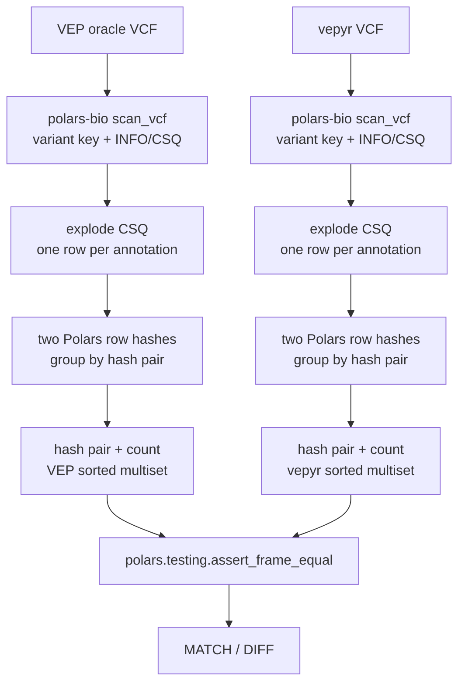

# VEP-vs-vepyr DataFrame Concordance

This directory contains a small reviewer-facing comparator for semantic
annotation concordance. It compares VEP and vepyr outputs as unordered Polars
data frames, not as byte-identical VCF files.

The comparator deliberately ignores VCF container presentation fields such as
`QUAL`, `FILTER`, `FORMAT`, and sample columns. It reads only the variant key
and `INFO/CSQ`, explodes CSQ into one annotation row per consequence, summarizes
the resulting annotation rows as a multiset table, and compares those tables
with `polars.testing.assert_frame_equal`.

For full WGS memory use, the asserted table stores two independent Polars row
hashes plus a count:

```text
annotation_hash_0, annotation_hash_1, count
```

The semantic input row being hashed is:

```text
chrom, pos, ref, alt, csq_entry
```

The default reader is `polars-bio`; use `--reader csv` only as a fallback.

## Usage

Requires the repository dev environment because it uses `polars` and
`polars-bio`.

Run through the parent harness:

```bash
../run_concordance.sh dataframe
```

Or run this comparator directly:

```bash
python compare_annotation_frames.py vep.vcf vepyr.vcf
```

For publication profiles the CSQ field sets should match exactly. During
development, compare only the shared CSQ fields with:

```bash
python compare_annotation_frames.py vep.vcf vepyr.vcf --allow-field-differences
```

## Output

The script prints:

- number of shared CSQ fields,
- CSQ fields present only on one side, if any,
- semantic input columns,
- asserted DataFrame columns,
- total annotation rows on each side,
- number of unique annotation rows on each side,
- comparator used,
- first mismatch examples when a difference is found.

Exit code is `0` only for a full semantic match.

## Why not MD5 only?

The MD5 harness is intentionally stricter and useful for proving that a fully
canonical VCF body can match exactly. This comparator is the publication-facing
semantic check: it tests whether the annotations agree after removing VCF writer
presentation differences that are not part of the VEP annotation model.

## Why Polars assert?

The comparison itself is delegated to `polars.testing.assert_frame_equal`, which
is the official Polars testing helper for DataFrame/LazyFrame equality. The
script only prepares a deterministic semantic multiset before calling that
assert.

## Pipeline Diagram


