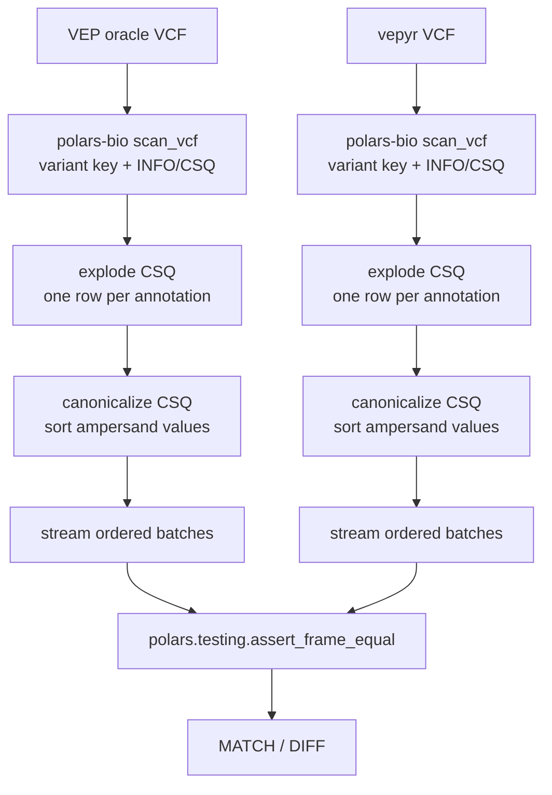

# VEP-vs-vepyr DataFrame Concordance

This directory contains a small reviewer-facing comparator for semantic
annotation concordance. It compares VEP and vepyr annotation rows as ordered
Polars DataFrame batches.

The comparator deliberately ignores VCF container presentation fields such as
`QUAL`, `FILTER`, `FORMAT`, and sample columns. It reads only the variant key
and `INFO/CSQ`, explodes CSQ into one annotation row per consequence,
canonicalizes ampersand-delimited values inside each CSQ field, and compares
successive batches with `polars.testing.assert_frame_equal`.

This is intentionally order-sensitive. It is appropriate for profiles where
VEP and vepyr are expected to emit the same variant and CSQ order. It is not the
right comparator for known order-unstable VEP modes such as `--per_gene`.

The asserted columns are:

```text
chrom, pos, ref, alt, canonical_csq_entry
```

Row multiplicity is preserved as repeated rows.

## Usage

Run through the parent harness:

```bash
../run_concordance.sh dataframe
```

Or run this comparator directly:

```bash
python compare_annotation_frames.py vep.vcf vepyr.vcf
```

Adjust streaming batch size:

```bash
python compare_annotation_frames.py vep.vcf vepyr.vcf --chunk-size 500000
```

Print progress every N compared annotation rows:

```bash
python compare_annotation_frames.py vep.vcf vepyr.vcf --progress-every 1000000
```

## Output

The script prints:

- number of shared CSQ fields,
- CSQ fields present only on one side, if any,
- semantic input columns,
- CSQ canonicalization rule,
- asserted DataFrame columns,
- progress interval,
- compared annotation row count,
- comparator used,
- first mismatch examples when a difference is found.

Exit code is `0` only for a full ordered semantic match.

## Why Ordered?

The MD5 harness is intentionally stricter and useful for proving that a fully
canonical VCF body can match exactly. This DataFrame comparator keeps the same
order assumption while removing VCF writer presentation differences. That makes
it simpler and faster than an unordered full-WGS comparator that would need a
global sort or bucketing.

## Pipeline Diagram


