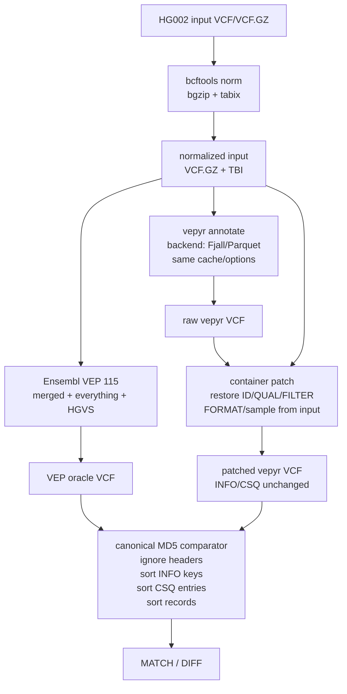

# VEP-vs-vepyr MD5 Concordance

This directory contains small, explicit scripts for reviewer-facing canonical
MD5 comparison between Ensembl VEP and vepyr VCF output.

## Full Pipeline

Normalize the HG002 input, run vepyr, patch known VCF container presentation
differences, and compare the result to the VEP oracle with
`canonical_md5_vcf.py`.

```bash
# Default publication seed profile:
# merged cache, Fjall backend, everything+HGVS.
./run_md5_concordance.sh

# Same profile with the parquet backend.
BACKEND=parquet ./run_md5_concordance.sh
```

Override defaults with `PROFILE=vep|merged|refseq`, `BACKEND=fjall|parquet`,
`INPUT_VCF`, `VEP_VCF`, `CACHE_DIR`, `FASTA`, or `OUT_DIR`.

## Individual Steps

Normalize and index the input VCF:

```bash
./normalize_vcf.sh input.vcf.gz results/md5-concordance/input.normalized.vcf.gz
```

Run only vepyr:

```bash
uv run python run_vepyr_vcf.py input.vcf.gz cache_dir reference.fa output.vcf \
    --backend fjall \
    --profile merged
```

Restore VCF container fields from the normalized input while preserving vepyr's
`INFO/CSQ` annotations:

```bash
python patch_vcf_container_for_md5.py input.normalized.vcf.gz vepyr.vcf vepyr.container-patched.vcf
```

Compare VCF bodies with canonical MD5:

```bash
python canonical_md5_vcf.py vep.vcf vepyr.container-patched.vcf
```

## Output

- `results/md5-concordance/vepyr.{profile}.{features}.{backend}.vcf`
- `results/md5-concordance/vepyr.{profile}.{features}.{backend}.container-patched.vcf`
- `results/md5-concordance/canonical-md5.{profile}.{features}.{backend}.txt`

The container patch step is intentionally separate from the comparator. It
restores non-INFO fields from the normalized input VCF (`ID`, `QUAL`, `FILTER`,
`FORMAT`, and sample columns) while keeping vepyr's `INFO/CSQ` annotations.
These presentation fixes are expected to move into the main vepyr VCF writer
later.

## Pipeline Diagram


