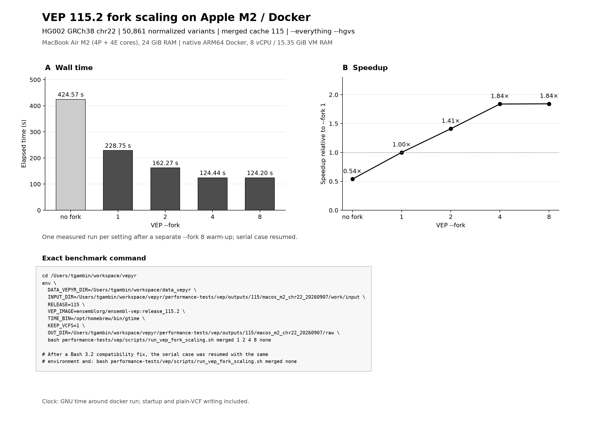

# VEP 115.2 fork scaling on macOS / Apple M2

This benchmark uses the repository's existing
`performance-tests/vep/scripts/run_vep_fork_scaling.sh` and
`performance-tests/vep/scripts/plot_vep_fork_scaling.py`.
The runner was identical to the linked upstream script before adding two
portability parameters: `INPUT_DIR` and `TIME_BIN`, plus progress messages and
a Bash 3.2-compatible expansion of the empty no-fork argument array.
The VEP command and annotation options are unchanged.



[PDF](vep115_macos_chr22_scaling.pdf) | [SVG](vep115_macos_chr22_scaling.svg) |
[timing table](summary.tsv)

For this chr22 run, fork 8 is **1.84x faster than fork 1** and **3.42x faster
than no fork**, with a plateau from 4 to 8. Each setting has one measurement.
Known VEP fork-dependent `HGNC_ID` differences are not a benchmark blocker.

## Environment and workload

- Host: MacBook Air, Apple M2 (4 performance + 4 efficiency cores), 24 GiB RAM,
  macOS 15.5.
- Docker Desktop engine/client: 29.1.3; 8 vCPU and 15.35 GiB VM RAM.
- Container: native `linux/arm64`, not an x86-emulated image.
- Image: `ensemblorg/ensembl-vep:release_115.2`.
- Image digest: `sha256:ff3c7e20d68e7e499c0bd79d398c7c121465db65f311ee87df425b2b600b853e`.
- Cache: `/Users/tgambin/workspace/data_vepyr/homo_sapiens_merged/115_GRCh38`.
- Input: HG002 GRCh38 v4.2.1, all of chr22: 50,284 source records; 577
  multiallelic records split with `bcftools norm -m -both`; 50,861 input records.
- `bcftools`/htslib: 1.23.1. No additional left-alignment step was applied.
- Annotation flags: `--merged --offline --everything --hgvs`, reference FASTA,
  plain VCF output, and each requested `--fork` value.
- One separate full-chromosome warm-up with `--fork 8`, followed by one measured
  run each in the order `1, 2, 4, 8, none`. `none` omits `--fork` entirely.

The initial serial invocation stopped in Bash before Docker launched because
macOS Bash 3.2 and `set -u` reject the original empty-array expansion. After
fixing that expansion, only `none` was resumed, using the same environment and
the same existing runner. The four successful measurements were retained.

## Reproducibility

The exact measured command is stored in [command.txt](command.txt). The plot
reads this file directly with `--command-file`; it does not reconstruct a
generic command or substitute Linux paths.
The serial resumption is recorded in `resume-command.txt`.

Input preparation from the repository root:

```bash
bcftools view -r chr22 -Ou \
  /Users/tgambin/workspace/data_vepyr/HG002_GRCh38_1_22_v4.2.1_benchmark.vcf.gz |
bcftools norm -m -both -Oz -o \
  performance-tests/vep/outputs/115/macos_m2_chr22_20260907/work/input/HG002_normalized.vcf.gz
bcftools index --tbi \
  performance-tests/vep/outputs/115/macos_m2_chr22_20260907/work/input/HG002_normalized.vcf.gz
```

The prepared input directory also contains a filesystem clone of the local
GRCh38 FASTA and a copy of its `.fai`, so the Docker bind mount is self-contained.
The original VCF, FASTA and cache are unchanged.

Normalized input SHA-256:
`10c3b2069d508d77da318222d830b7bea58c64e2ff43c5f7a044785a73ea4e97`.
Cache `info.txt` SHA-256:
`9de88b8e72bc364c5104cd6d4e1513a006c8c6dbd41cfbb05cb5fb24d4b2a747`.

## Interpretation

GNU time measures the elapsed duration of `docker run`, including startup,
annotation and writing the plain VCF. Its RSS is that of the host Docker CLI,
not VEP's memory use inside the VM, and must not be presented as VEP peak RSS.
`--fork 1` also has a parent process; it is not a strict single-core CPU cap.
The separate no-fork measurement allows comparison with VEP's serial path.

This is an exploratory single-run scaling check on chr22 after warm-up. It is
not a replicated whole-genome performance claim. Do not merge these timings
with the release-116 Linux WGS series or infer vepyr performance from them.

The runner retains its original filenames containing `wgs` for compatibility
with the existing collectors; every VCF in this run nevertheless contains
chr22 only. Large VCFs and the staging directory are excluded from Git.

## Run on another laptop

Check out `performance/vep-macos` and run the commands below from the repository
root. Nothing requires vepyr to be built or installed.

Prerequisites: running Docker, GNU time (`brew install gnu-time` on macOS;
`/usr/bin/time` on Linux), `bcftools`, and Python 3.11+ for plotting. Supply the
merged **115_GRCh38** cache, indexed HG002 GRCh38 v4.2.1 benchmark VCF and
GRCh38 primary-assembly FASTA with its `.fai`. Use the same data/version pair
when comparing laptops. Leave several GB free for the FASTA and output VCFs.
On Docker Desktop, record the allocated CPU/RAM and use the native image
architecture; no `--platform` emulation is requested here.

Set your own data root; the filenames below match this run. A fresh directory
is created so the existing measurements are not overwritten.

```bash
export DATA_VEPYR_DIR=/absolute/path/to/data_vepyr
mkdir -p performance-tests/vep/outputs/115
export VEP_BENCH_DIR=$(mktemp -d "$PWD/performance-tests/vep/outputs/115/laptop_chr22.XXXXXX")
export INPUT_DIR="$VEP_BENCH_DIR/input"
export RELEASE=115
export VEP_IMAGE=ensemblorg/ensembl-vep:release_115.2
export KEEP_VCFS=1
mkdir -p "$INPUT_DIR"

bcftools view -r chr22 -Ou \
  "$DATA_VEPYR_DIR/HG002_GRCh38_1_22_v4.2.1_benchmark.vcf.gz" |
bcftools norm -m -both -Oz -o "$INPUT_DIR/HG002_normalized.vcf.gz"
bcftools index --tbi "$INPUT_DIR/HG002_normalized.vcf.gz"
cp "$DATA_VEPYR_DIR/Homo_sapiens.GRCh38.dna.primary_assembly.fa" "$INPUT_DIR/"
cp "$DATA_VEPYR_DIR/Homo_sapiens.GRCh38.dna.primary_assembly.fa.fai" "$INPUT_DIR/"

# Expected: 50,861 input records. GNU time is selected automatically by OS.
bcftools index --nrecords "$INPUT_DIR/HG002_normalized.vcf.gz"

# Separate warm-up, excluded from the measured plot.
OUT_DIR="$VEP_BENCH_DIR/warmup" \
  bash performance-tests/vep/scripts/run_vep_fork_scaling.sh merged 8

# Measured runs, using --everything --hgvs.
OUT_DIR="$VEP_BENCH_DIR/raw" \
  bash performance-tests/vep/scripts/run_vep_fork_scaling.sh merged 1 2 4 8 none
```

Keep the computer plugged in and avoid other heavy workloads. Choose fork
values that fit the Docker CPU allocation. Reusing an output directory and
fork value replaces that measurement: use a fresh directory for each repeat.
Save your actual environment assignments and measured command as
`$VEP_BENCH_DIR/command.txt` before plotting; do not reuse this Mac's command
file for another laptop. The expanded Docker command is also recorded in each
`raw/*.time.txt` file.

Create an isolated plotting environment (tested: Python 3.12.12,
Matplotlib 3.11.1):

```bash
python3 -m venv "$VEP_BENCH_DIR/plot-env"
"$VEP_BENCH_DIR/plot-env/bin/python" -m pip install 'matplotlib==3.11.1'
"$VEP_BENCH_DIR/plot-env/bin/python" \
  performance-tests/vep/scripts/plot_vep_fork_scaling.py \
  --cache-type merged --release 115 --records 50861 \
  --input-dir "$VEP_BENCH_DIR/raw" \
  --summary "$VEP_BENCH_DIR/summary.tsv" \
  --output "$VEP_BENCH_DIR/vep115_chr22_scaling.png" \
  --title 'VEP 115.2 fork scaling / Docker' \
  --dataset 'HG002 GRCh38 chr22' --baseline-fork 1 --scaling-panels \
  --environment 'REPLACE: laptop / CPU / RAM / Docker vCPU and VM RAM' \
  --run-note 'One measured run per setting after a separate --fork 8 warm-up.' \
  --command-file "$VEP_BENCH_DIR/command.txt"
```

The same call writes PNG, PDF and SVG. `--scaling-panels` preserves fractional
seconds; omitting it retains the historical Linux plot and integer-second TSV.
To share a new run, copy only time/stderr logs, TSVs, command text, plots and
an environment description; omit VCFs, FASTA, cache and the Python environment.

## Regenerate this committed figure

With Matplotlib installed, from the repository root:

```bash
python3 performance-tests/vep/scripts/plot_vep_fork_scaling.py \
  --cache-type merged --release 115 --records 50861 \
  --input-dir performance-tests/vep/outputs/115/macos_m2_chr22_20260907/raw \
  --summary performance-tests/vep/outputs/115/macos_m2_chr22_20260907/summary.tsv \
  --output performance-tests/vep/outputs/115/macos_m2_chr22_20260907/vep115_macos_chr22_scaling.png \
  --title 'VEP 115.2 fork scaling on Apple M2 / Docker' \
  --dataset 'HG002 GRCh38 chr22' --baseline-fork 1 --scaling-panels \
  --environment 'MacBook Air M2 (4P + 4E cores), 24 GiB RAM | native ARM64 Docker, 8 vCPU / 15.35 GiB VM RAM' \
  --run-note 'One measured run per setting after a separate --fork 8 warm-up; serial case resumed.' \
  --command-file performance-tests/vep/outputs/115/macos_m2_chr22_20260907/command.txt
```
